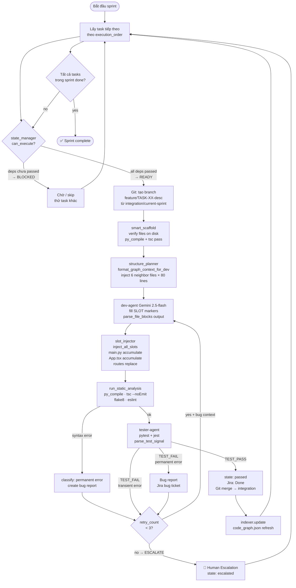
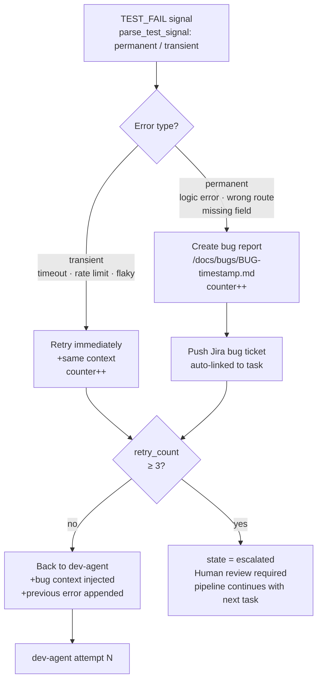

# 🤖 Agentic SDLC Pipeline — AI-Driven Software Development

> **Tự động hoá toàn bộ vòng đời phát triển phần mềm** từ một câu prompt ngắn đến production-ready code, sử dụng multi-agent orchestration với Gemini 2.5, deterministic preprocessing, và contract-first development.

<div align="center">


</div>

---

## 📌 Tổng quan

Pipeline này giải quyết bài toán: **LLM tự mình viết cả một hệ thống phần mềm hoàn chỉnh** mà không bị mất context, không xung đột giữa các phần, và không cần lập trình viên can thiệp thủ công vào từng bước.

**Demo:** Đưa vào prompt `"Build me a POS app"` → pipeline tự động sinh ra:
- ✅ Product Requirements Document (PRD)
- ✅ System architecture với API contracts
- ✅ Dependency-ordered task list + Jira sprint
- ✅ Runnable FastAPI backend + React/TypeScript frontend
- ✅ pytest + Jest test suite
- ✅ Docker Compose deployment

**Thời gian thực thi:** ~15–25 phút cho MVP với 10–12 tasks song song hoá.

---

## 🧠 Core Design Philosophy

Ba vấn đề lớn nhất khi dùng LLM để viết code hệ thống:

| Vấn đề | Triệu chứng | Giải pháp trong pipeline này |
|--------|-------------|------------------------------|
| **Hallucination routes** | Planner bịa API routes không có trong architecture | `contract_normalizer` — `architecture.json` là single source of truth, Planner không được phép thêm routes |
| **Context loss** | Task-05 overwrite code của Task-04 | `smart_scaffold` + `slot_injector` — LLM chỉ fill vào bounded [SLOT], không bao giờ ghi đè toàn bộ file |
| **Dependency chaos** | Task viết Cart trước khi Auth service tồn tại | `dependency_graph` (Kahn's algorithm) + `state_manager.can_execute()` — block task cho đến khi deps passed |

**Nguyên tắc cốt lõi: Deterministic preprocessing trước AI.** Mọi suy luận nào có thể làm bằng code (topo sort, schema validation, file structure planning) đều được thực hiện bằng Python trước khi LLM được gọi. LLM chỉ làm những gì code không thể làm được.

---

## 🗂️ Kiến trúc hệ thống

```
agentic-sdlc/
├── .claude/
│   └── agents/                         # Agent instruction files (system prompts)
│       ├── requirement-agent-gemini.md  # PM Agent — PRD + entities
│       ├── architect-agent.md           # Architect — service boundaries + API surface
│       ├── planner-agent-gemini.md      # Planner — sprint/priority/story_points only
│       ├── dev-agent-core.md            # Dev Agent — shared rules (output format, contract compliance)
│       └── dev-agent-gemini.md          # Dev Agent — scaffold+slot-fill execution model
├── orchestrator_v2.py                   # Main loop — Phase 1/2/3 controller
├── adapter_v2.py                        # Gemini API router — gọi từng agent
├── parser.py                            # Parser — strip fences, extract JSON, parse file blocks
├── knowledge_graph_builder.py           # Deterministic — entity enrichment + edge inference
├── dependency_graph.py                  # Deterministic — Kahn's topo sort + cycle detection
├── task_materializer.py                 # Deterministic — ExecutableTask schema + self-dep strip
├── contract_normalizer.py               # Deterministic — lock routes từ architecture.json
├── structure_planner.py                 # Deterministic — KG-driven file list + [SLOT] markers
├── smart_scaffold.py                    # Deterministic — tạo files hợp lệ với [SLOT], verify syntax
├── slot_injector.py                     # Deterministic — chèn LLM code vào đúng slot, dedup
├── state_manager.py                     # Deterministic — execution_state.json, can_execute()
├── indexer.py                           # Deterministic — AST scan → code_graph.json
└── docs/
    ├── requirements.md
    ├── entities.json
    ├── stories.json
    ├── architecture.json
    ├── dependency_graph.json
    ├── materialized_tasks.json
    ├── tasks.json
    ├── contracts/
    │   └── TASK-XX.contract.json
    ├── execution_state.json
    └── code_graph.json
```

---

## 🔄 Pipeline Flow — 7 Phases

```mermaid
flowchart TD
    A([👤 Human Prompt]) --> B

    subgraph P1["Phase 1 — Requirement [AI]"]
        B[requirement-agent\nGemini 2.0-flash\nrequirement-agent-gemini.md]
        B --> B1[(entities.json\nstories.json\nrequirements.md)]
    end

    subgraph P2["Phase 2 — System Design [AI + Deterministic]"]
        B1 --> C[knowledge_graph_builder\n🔷 Deterministic\nkeyword match · confidence scoring]
        C --> C1[(knowledge_graph.json)]
        C1 --> D[architect-agent\nGemini 2.5-flash\narchitect-agent.md + KG context]
        D --> D1[(architecture.json\nservices · api_routes · depends_on)]
    end

    subgraph P3["Phase 3 — Execution Planning [Deterministic + AI]"]
        D1 --> E[dependency_graph\n🔷 Kahn's algorithm\ncycle detect · topo sort]
        D1 --> F[task_materializer\n🔷 ExecutableTask schema\nstrip self-deps]
        E --> G
        F --> G[planner-agent\nGemini 2.0-flash\nsprint · priority · story_points ONLY]
        G --> G1[(tasks.json)]
        G1 --> H[contract_normalizer\n🔷 architecture.json wins\ndiscard Planner hallucinations]
        H --> H1[(contracts/TASK-XX.json)]
    end

    subgraph P3B["Phase 3b — Jira Sync [Infrastructure]"]
        H1 --> I[Atlassian MCP Server\ncreate project · sprint · tickets]
    end

    subgraph P4["Phase 4 — Scaffold Prep [Deterministic — 1 lần cho cả sprint]"]
        H1 --> J[structure_planner\n🔷 KG-driven\nfile list · SLOT markers · graph context]
        J --> K[smart_scaffold\n🔷 tạo files với SLOT\npy_compile + tsc verify]
        K --> K1[(src/ files on disk\nwith SLOT markers)]
    end

    subgraph P5["Phase 5 — Sprint Execution Loop [orchestrator_v2.py]"]
        K1 --> L{state_manager\ncan_execute?}
        L -- blocked --> L
        L -- ready --> M[dev-agent\nGemini 2.5-flash\ndev-agent-core.md + gemini.md\nfill SLOT markers]
        M --> N[slot_injector\n🔷 inject_all_slots\nmain.py accumulate · App.tsx accumulate]
        N --> O[tester-agent\nGemini Haiku\npytest + jest\nparse_test_signal]
        O -- PASS --> P[state: passed\nGit merge → integration branch\nJira: Done]
        O -- FAIL\nretry ≤ 3 --> M
        O -- FAIL\n> 3 times --> Q[🚨 Human Escalation\nbug report → /docs/bugs/]
        P --> R{next task?}
        R -- yes --> L
        R -- no --> S
    end

    subgraph P6["Phase 6 — CI/CD [GitHub Actions]"]
        S[lint · build check\nDeploy → Staging]
    end

    subgraph P7["Phase 7 — Production Release [Human Approval]"]
        S --> T{Approved?}
        T -- YES --> U([🚀 Production\nVercel · Railway · Render])
        T -- NO --> V[Rollback\nnew sprint → Phase 5]
    end

    style P1 fill:#E8F5E9,stroke:#4CAF50
    style P2 fill:#E3F2FD,stroke:#2196F3
    style P3 fill:#FFF3E0,stroke:#FF9800
    style P3B fill:#F3E5F5,stroke:#9C27B0
    style P4 fill:#E8EAF6,stroke:#3F51B5
    style P5 fill:#FCE4EC,stroke:#E91E63
    style P6 fill:#E0F2F1,stroke:#009688
    style P7 fill:#F1F8E9,stroke:#8BC34A
```



---

## ⚙️ Chi tiết từng module

### 🤖 AI Agents (Gemini)

#### `requirement-agent-gemini.md`
**Model:** Gemini 2.0-flash | **Input:** Human prompt | **Output:** `entities.json`, `stories.json`, `requirements.md`

Vai trò PM — extract **feature entities** (không phải vague goals) từ prompt. Mỗi entity backend **bắt buộc phải có ≥ 2 HTTP routes cụ thể** trong description. Rule quan trọng: `Cart` và `Checkout` là 2 entities riêng biệt — tránh merge quá aggressive.

```json
// entities.json — output format
[
  {
    "id": "ENT-03",
    "name": "Cart management",
    "description": "POST /cart/add, GET /cart, DELETE /cart/clear — manages in-session cart",
    "component": "backend",
    "complexity": "medium",
    "depends_on": ["ENT-01"]
  }
]
```

#### `architect-agent.md`
**Model:** Gemini 2.5-flash | **Input:** `entities.json` + `knowledge_graph.json` | **Output:** `architecture.json`

Quyết định service boundaries, API surface (method/path/status_code/request_body/response_body/errors), shared types. **Không được** gán task_id (việc của `task_materializer`), **không được** quyết định sprint (việc của `planner-agent`).

```json
// architecture.json — api_routes format (contract locked tại đây)
{
  "method": "POST",
  "path": "/cart/add",
  "status_code": 201,
  "request_body": { "product_id": "int", "quantity": "int" },
  "response_body": { "cart_id": "int", "product_id": "int", "quantity": "int" },
  "errors": [{ "status_code": 404, "when": "product not found" }]
}
```

#### `planner-agent-gemini.md`
**Model:** Gemini 2.0-flash | **Input:** `materialized_tasks.json` | **Output:** `tasks.json`

**Chỉ được làm 4 việc:** gán `sprint`, `priority` (P0/P1/P2), `story_points` (2/5/8), viết `acceptance_criteria`. Copy nguyên `api_routes` từ materialized_tasks — không được thêm/sửa/xoá route.

#### `dev-agent` (core + gemini)
**Model:** Gemini 2.5-flash | **Input:** contract + scaffold files + graph context

`parser.py` load: `dev-agent-core.md` (base rules) + `dev-agent-gemini.md` (slot-fill execution model). Dev agent nhận danh sách files đã scaffold sẵn với `[SLOT]` markers, **chỉ fill vào slot** — không rewrite toàn bộ file.

**Graph-aware:** được inject code của 6 neighbor files (80 dòng đầu mỗi file) từ `code_graph.json` để tránh define lại state đã tồn tại.

---

### 🔷 Deterministic Modules (Python)

#### `knowledge_graph_builder.py`
Nhận `entities.json` → enrich từng entity với `domain_tags`, `lifecycle`, `ownership`, `security_level`, `data_shape` → infer edges ẩn (Cart `owns` Product, Payment `triggers` Notification) với **confidence scoring**.

```
Explicit deps  → confidence 1.0
Keyword match  → confidence 0.7–0.8
Heuristic rule → confidence 0.65
```

Chỉ edges có `confidence ≥ 0.65` được inject vào architect prompt. Đây là cơ chế kiểm soát "bao nhiêu suy luận rủi ro được phép đi vào LLM context."

#### `dependency_graph.py`
Kahn's algorithm cho topo sort + cycle detection. Không cần networkx (có fallback thuần Python). Output: `execution_order` + `parallel_groups` (các task cùng depth có thể chạy song song).

```python
# Parallel groups — các task cùng depth chạy concurrently
[["TASK-01"], ["TASK-02", "TASK-03"], ["TASK-04", "TASK-05"], ["TASK-06"]]
```

#### `task_materializer.py`
Convert services từ `architecture.json` → `ExecutableTask` schema theo đúng topo sort order. Bug fix quan trọng: `_strip_self_deps()` — remove `TASK-11 depends_on TASK-11` (LLM đôi khi sinh ra self-loop làm task bị skip vĩnh viễn).

#### `contract_normalizer.py`
**Single source of truth enforcement.** Khi detect mismatch giữa routes trong `architecture.json` và `tasks.json` (Planner hallucination), log rõ cả hai set rồi chọn architecture làm winner. Export từng file `contracts/TASK-XX.contract.json` riêng biệt.

#### `structure_planner.py`
Quyết định **deterministic** danh sách chính xác files nào cần tạo cho mỗi task, role của từng file (`routes`, `model`, `page`...), slot marker tương ứng. LLM dev agent **không được quyết định** file structure — chỉ được fill vào bounded slot. `format_graph_context_for_dev()` inject 80 dòng đầu của 6 neighbor files vào dev agent context.

#### `smart_scaffold.py` + `slot_injector.py`
**Cặp đôi giải quyết vấn đề merge conflict và overwrite:**

1. `smart_scaffold` tạo files hợp lệ cú pháp với `[SLOT]` markers, chạy `py_compile.compile()` và `tsc --noEmit` ngay sau khi tạo.
2. `slot_injector` phân loại từng file và chèn code đúng chỗ:
   - `main.py` → **accumulate mode**: append `include_router()` vào `[MAIN_ROUTER_SLOT]`, không bao giờ ghi đè
   - `App.tsx` → **accumulate mode**: dedup imports, tích lũy pages từ nhiều tasks
   - Route files → **replace mode**: replace nội dung trong slot với code mới
   - New files → **write mode**: ghi thẳng

#### `state_manager.py`
Lưu trạng thái từng task vào `docs/execution_state.json`. Hàm quan trọng nhất: `can_execute(task)` — duyệt qua `depends_on`, block task nếu bất kỳ dependency nào chưa `passed`.

```
pending → in_progress → passed
                      → failed → (retry) → in_progress
                               → (>3 fails) → escalated
         → blocked  (deps chưa passed)
```

#### `indexer.py`
Sau mỗi task pass, scan toàn bộ `src/backend/app/` (AST parser) và `src/frontend/src/` (regex) → extract routes, symbols, exports, API calls → lưu vào `code_graph.json`. Cung cấp real-time code intelligence cho dev agent của các task sau.

#### `parser.py`
Layer trung gian giữa mọi agent response và pipeline. Xử lý:
- `load_agent_instruction()` — load `dev-agent-core.md` + `dev-agent-{backend}.md` và merge
- `strip_fences()` — bỏ markdown code fences khỏi Gemini response
- `extract_json_object()` / `extract_json_array()` — parse JSON an toàn
- `split_prd_and_stories()` — phân loại entities vs stories bằng field signature
- `parse_file_blocks()` — parse `FILE: path\n```lang\ncode\n````  format từ dev agent
- `parse_test_signal()` — parse `TEST_PASS:TASK-01` hoặc `TEST_FAIL:TASK-01:2:0`

---



## 🧩 Data Flow — Artifact Handoff

```mermaid
graph LR
    P["Human Prompt"] -->|raw text| REQ["requirement-agent"]
    REQ -->|entities.json| KG["knowledge_graph_builder"]
    REQ -->|stories.json| MAT["task_materializer"]
    KG -->|knowledge_graph.json\nconfidence-weighted| ARC["architect-agent"]
    ARC -->|architecture.json\nservices + api_routes| DEP["dependency_graph"]
    ARC -->|architecture.json| MAT
    DEP -->|execution_order\ntopo sorted| MAT
    MAT -->|materialized_tasks.json\nExecutableTask schema| PLA["planner-agent"]
    PLA -->|tasks.json\nsprint + priority| CON["contract_normalizer"]
    ARC -->|architecture.json\nsource of truth| CON
    CON -->|contracts/TASK-XX.json\nlocked routes| STR["structure_planner"]
    KG -->|knowledge_graph.json| STR
    STR -->|structure_plans/\nfile list + slots| SCA["smart_scaffold"]
    SCA -->|src/ files with SLOT| DEV["dev-agent"]
    CON -->|contract context| DEV
    STR -->|graph context\n6 neighbor files| DEV
    DEV -->|FILE: path code blocks| INJ["slot_injector"]
    INJ -->|filled files on disk| TST["tester-agent"]
    TST -->|TEST_PASS/FAIL signal| STA["state_manager"]
    INJ -->|files after each pass| IDX["indexer"]
    IDX -->|code_graph.json| DEV

    style CON fill:#FFF3E0,stroke:#FF9800
    style SCA fill:#E8EAF6,stroke:#3F51B5
    style INJ fill:#E8EAF6,stroke:#3F51B5
    style KG fill:#E8EAF6,stroke:#3F51B5
    style DEP fill:#E8EAF6,stroke:#3F51B5
    style MAT fill:#E8EAF6,stroke:#3F51B5
    style STR fill:#E8EAF6,stroke:#3F51B5
    style IDX fill:#E8EAF6,stroke:#3F51B5
```



---

## 🔐 Contract System — Single Source of Truth

Một trong những design decision quan trọng nhất của pipeline: **`architecture.json` là nguồn duy nhất được phép định nghĩa API routes.**

```
architecture.json (Architect AI)
         │
         ├──► contract_normalizer ──► TASK-XX.contract.json
         │          │
         │    [nếu Planner hallucinate routes khác]
         │    [log mismatch → discard Planner routes]
         │    [architecture.json ALWAYS wins]
         │
         └──► dev-agent reads contract ──► implements EXACT routes
                                      ──► tester-agent validates EXACT routes
```

**Tại sao quan trọng:** Nếu không có lớp này, Planner AI sẽ tự bịa thêm routes (ví dụ: thêm `GET /cart/summary` không có trong architecture), dev agent implement routes đó, và tester agent test routes đó — nhưng routes đó không bao giờ được thiết kế đúng, dẫn đến cascade failure.

---

## 🛡️ Error Classification & Recovery



---

## 🔧 Tech Stack

| Layer | Technology | Ghi chú |
|-------|------------|---------|
| **AI Model** | Gemini 2.5-flash (dev/architect), Gemini 2.0-flash (req/planner) | Cost optimization theo agent role |
| **Orchestration** | Python 3.11+, orchestrator_v2.py | Sequential queue, circuit breaker |
| **Backend generated** | FastAPI + Pydantic v2, Python 3.11 | Synchronous endpoints, in-memory state |
| **Frontend generated** | React 18 + TypeScript + Vite | Fetch API, VITE_API_URL configurable |
| **Testing generated** | pytest (backend), Jest (frontend) | TestClient, contract-driven assertions |
| **Graph analysis** | networkx (optional), fallback Kahn's | Topo sort + cycle detection |
| **Code analysis** | Python `ast` module (backend), regex (frontend) | Không cần external parser |
| **Project management** | Atlassian MCP Server (Jira) | Auto-create project/sprint/tickets |
| **Version control** | Git (branch per task, merge on pass) | integration/current-sprint backbone |
| **CI/CD** | GitHub Actions | ESLint + Flake8 + build check |
| **Deployment** | Vercel (frontend), Railway/Render (backend), Docker Compose | |

---

## 🚀 Quick Start

```bash
# 1. Clone và setup
git clone https://github.com/your-username/agentic-sdlc-pipeline
cd agentic-sdlc-pipeline
python -m venv .venv && source .venv/bin/activate
pip install -r requirements.txt

# 2. Config API key
export GEMINI_API_KEY="your-gemini-api-key"

# 3. (Optional) Jira MCP config
cp .mcp.json.example .mcp.json
# Điền JIRA_HOST, JIRA_EMAIL, JIRA_API_TOKEN

# 4. Chạy pipeline
python orchestrator_v2.py --prompt "Build me a POS app with product management, cart, checkout, and receipt history"

# 5. Xem trạng thái
cat docs/execution_state.json
```

**Output structure sau khi chạy:**
```
docs/
├── requirements.md          ← PRD
├── entities.json            ← Feature entities
├── stories.json             ← User stories
├── architecture.json        ← System design
├── dependency_graph.json    ← Task ordering
├── materialized_tasks.json  ← ExecutableTask schema
├── tasks.json               ← Sprint plan
├── contracts/               ← Locked API contracts per task
├── execution_state.json     ← Live task status
└── code_graph.json          ← Real-time code intelligence

src/
├── backend/
│   └── app/
│       ├── main.py          ← FastAPI app (accumulated routers)
│       ├── routes/          ← One file per resource
│       └── models/          ← Pydantic models
└── frontend/
    └── src/
        ├── App.tsx           ← Accumulated pages + routes
        ├── pages/            ← One file per resource
        └── api/              ← Typed fetch clients
```

---

## 📊 Key Engineering Decisions

### 1. Tại sao không dùng LangChain / AutoGen?

Pipeline này được viết từ đầu bằng Python thuần để:
- **Full control** over agent communication protocol (không bị lock-in framework)
- **Predictable token budget** — biết chính xác cái gì được inject vào mỗi LLM call
- **Debuggable** — mọi intermediate artifact được ghi ra file, có thể inspect từng bước
- **Deterministic preprocessing** — không muốn framework thêm "magic" prompt engineering ngoài tầm kiểm soát

### 2. Tại sao Gemini thay vì GPT-4?

- **Context window lớn hơn** (1M tokens) — có thể inject toàn bộ architecture + existing code vào một call
- **Cost thấp hơn** đáng kể cho 10–15 LLM calls per task × 12 tasks
- **Gemini 2.5-flash** đủ mạnh cho code generation với proper scaffolding

### 3. Slot injection vs Full file generation

| Approach | Vấn đề |
|----------|---------|
| **Full file generation** (cũ) | Task-05 rewrite `App.tsx` → mất routes của Task-02, 03, 04 |
| **Slot injection** (mới) | LLM chỉ fill vào bounded region → không thể break existing code |

`main.py` và `App.tsx` dùng **accumulate mode** — mỗi task append vào, không bao giờ replace. Đây là cách duy nhất để nhiều tasks cùng contribute vào một file mà không xung đột.

### 4. Confidence scoring trong Knowledge Graph

```python
# Không phải mọi suy luận đều đáng tin như nhau
CONFIDENCE_EXPLICIT  = 1.0   # depends_on đã khai báo
CONFIDENCE_KEYWORD   = 0.75  # "cart" và "product" xuất hiện cùng nhau
CONFIDENCE_HEURISTIC = 0.65  # payment → notification (business rule)
THRESHOLD            = 0.65  # chỉ inject vào architect prompt nếu ≥ ngưỡng này
```

Nếu không có ngưỡng này, KG sẽ inject quá nhiều "maybe" edges vào architect context → architect design sai service boundaries.

---

## 🐛 Known Issues & Mitigations

| Issue | Root cause | Mitigation |
|-------|-----------|------------|
| Self-dependency loop | LLM sinh `TASK-11 depends_on: ["TASK-11"]` | `_strip_self_deps()` trong `task_materializer` |
| Double-numbered tasks | `materialize()` rebuild dep graph nếu `execution_order` đã có | Pass `execution_order` từ caller, không tính lại |
| App.tsx overwrite | Old slot injection không track existing imports | `inject_app_tsx()` dedup imports + accumulate mode |
| Route hallucination | Planner AI thêm routes không có trong architecture | `contract_normalizer` discard Planner routes, dùng architecture |
| Missing `router` prefix | FastAPI `prefix=` trong `APIRouter()` break contract validation | Dev agent rules: dùng full path trong decorator, không dùng prefix |

---

## 📈 Metrics & Observability

Sau mỗi sprint, pipeline xuất:

```bash
[STATE]
  passed=10  failed=0  blocked=0  running=0

[INDEXER]
  backend: 23 files, 47 routes, 156 symbols
  frontend: 18 files, 12 components, 34 API calls

[CONTRACTS]
  12 contracts verified, 0 route mismatches
```

Task-level tracking trong `docs/execution_state.json`:
```json
{
  "TASK-05": {
    "status": "passed",
    "message": "pytest: 8 passed, jest: 12 passed",
    "retry_count": 1,
    "updated_at": "2025-05-28 14:23:11"
  }
}
```

---

## 🗺️ Roadmap

- [ ] **Parallel task execution** — exploit `parallel_groups` từ dep graph để chạy concurrent tasks
- [ ] **PostgreSQL support** — migration generator khi requirement đòi persistent storage
- [ ] **Claude Code integration** — thay Gemini bằng Claude Code CLI cho dev agent (better tool use)
- [ ] **PR-based review loop** — tester agent comment trực tiếp lên GitHub PR
- [ ] **Multi-sprint memory** — code_graph persist across sprints, không scan lại từ đầu
- [ ] **Cost dashboard** — track token usage và cost per task/sprint

---

## 👤 Tác giả & Context

Project này được phát triển như một **proof of concept** cho agentic software development — hệ thống tự viết code thật, test thật, và deploy thật từ một câu prompt ngắn.

**Những gì đã học được:**
1. LLM + deterministic preprocessing > LLM một mình — preprocessing ổn định output, giảm retry rate
2. "Constrain then generate" > "Prompt harder" — ít degrees of freedom = output predictable hơn
3. Single source of truth với explicit divergence detection là bắt buộc trong multi-agent system
4. Fail fast + sanitize at boundary — garbage không được phép đi sâu vào pipeline

---

<div align="center">

**Stack:** Python · Gemini 2.5 · FastAPI · React 18 · TypeScript · Jira MCP · GitHub Actions

*Nếu thấy project thú vị, hãy ⭐ star và connect trên [LinkedIn](#)*

</div>